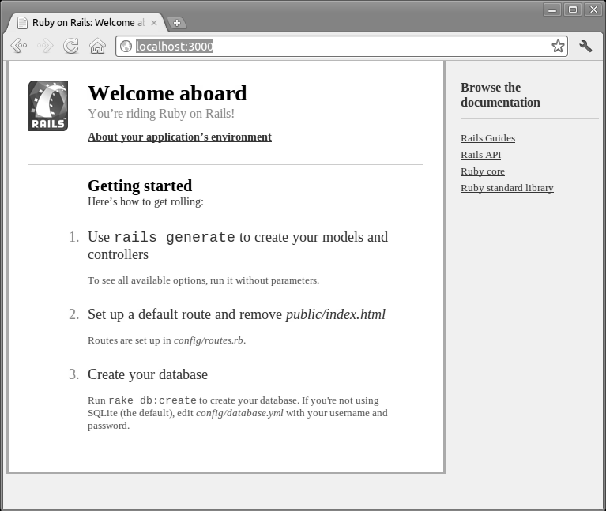
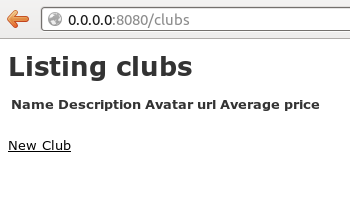
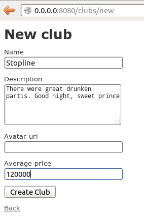
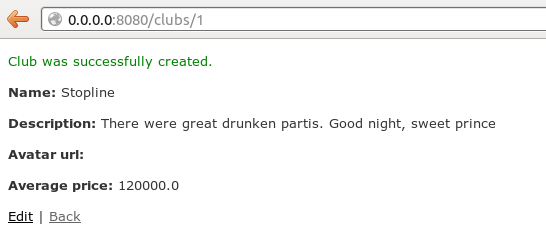
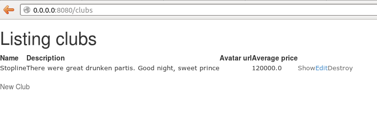
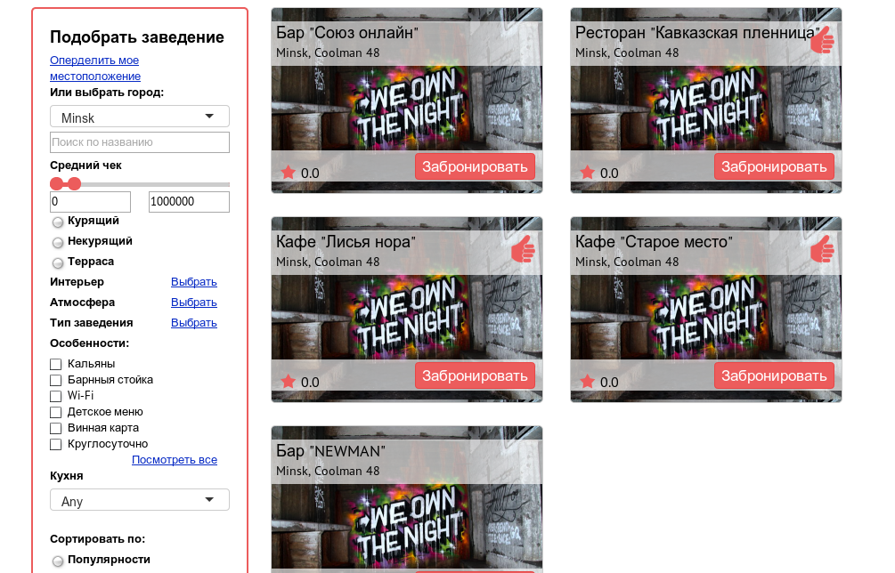
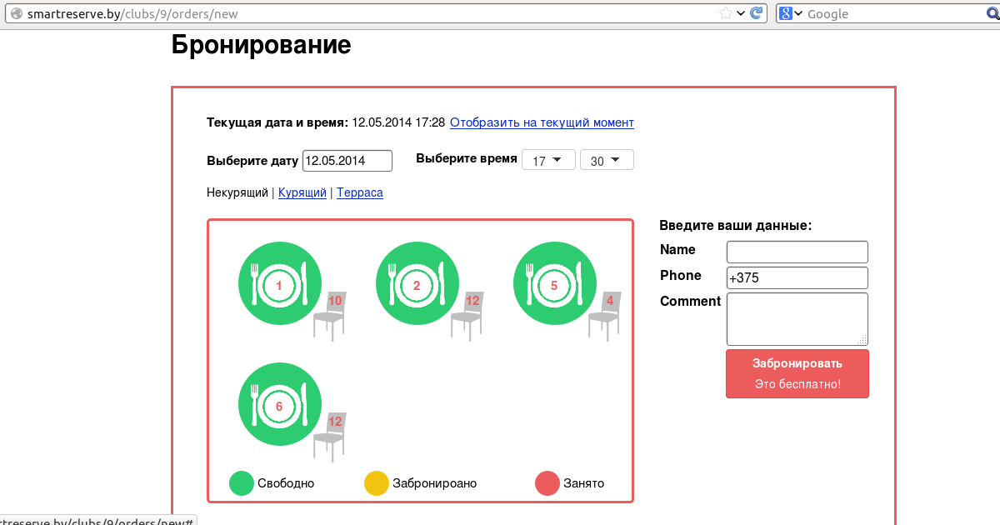

## СОДЕРЖАНИЕ ##
1 ВВЕДЕНИЕ 
2 ОПИСАНИЕ СРЕДЫ РАЗРАБОТКИ 
2.2.Язык разметки гипертекста (HTML)
2.2 Каскадные таблицы стилей (CSS)
2.3 Язык программирования Ruby
2.4 Ruby on Rails
2.5 Язык программирования JavaScript
2.6 Heroku
2.7 Шаблонизатор Slim
2.8 Twitter Bootstrap
3 РАЗРАБОТКА САЙТА
3.1 Установка Rails
3.3.Создание нового приложения
3.3 Генерирование временной платформы
3.4 Подключение плагинов
3.5 Модели
3.6 Каталог заведений
3.7 Заказы
4 ЗАКЛЮЧЕНИЕ
5 СПИСОК ИСПОЛЬЗОВАННОЙ ЛИТЕРАТУРЫ
6 ПРИЛОЖЕНИЕ А
7 ПРИЛОЖЕНИЕ Б

# ВВЕДЕНИЕ
Интернет – это всемирная система объединенных компьютерных сетей. Сегодня Интернет является одним из важнейших средств массовых коммуникаций. Эта мировая сеть по степени своей важности и значимости стоит рядом с телевидением, телефонной связью и прессой. Интернет представляет собой одно из главных средств общения, развлечения, торговли и рекламы. В Интернете можно найти практически все, что нужно любому человеку. Причем, не существует никаких территориальных или национальных ограничений для доступа к информации.
Интернет является самым быстроразвивающимся средством вещания в истории человечества. Ничто не может подать информацию человеку в удобном, понятном, интересном представлении, как, например, веб–сайт. Сайт может содержать в себе текст, графику, звук, анимацию, видео.
Однако перед пользователями все же зачастую возникает вопрос, где найти ту или иную интересующую их информацию на обширных просторах Интернета.
Задача курсовой работы – создание веб-приложения, позволяющего пользователю бронировать места в ресторанах в режиме онлайн.
Создание приложения будет осуществляться с помощью фреймворка Ruby on Rails.

# 1 ОПИСАНИЕ СРЕДЫ РАЗРАБОТКИ
## 1.1 Язык разметки гипертекста (HTML)
HTML (от англ. HyperText Markup Language – «язык разметки гипертекста») – стандартный язык разметки документов во Всемирной паутине. Большинство веб-страниц создаются при помощи языка HTML (или XHTML). Язык HTML интерпретируется браузерами и отображается в виде документа в удобной для человека форме.
HTML является приложением (частным случаем) SGML (стандартного обобщённого языка разметки) и соответствует международному стандарту ISO 8879.
HTML-документ представляет собой текстовый файл, содержащий собственно текст, который должен быть отображен в окне браузера, и команды разметки – HTML-тэги, определяющие внешний вид документа при его интерпретации в окне браузера.
Браузер – программное обеспечение для просмотра веб-сайтов, то есть для запроса веб-страниц (преимущественно из Сети), их обработки, вывода и перехода от одной страницы к другой. Многие современные браузеры также могут загружать файлы с FTP-серверов.
Документы в формате HTML обычно имеют расширение .html и записываются в текстовом формате, поэтому они могут быть созданы в любом текстовом редакторе. Форматирование документа осуществляется HTML-тэгами.
HTML-тэг записывается в угловых скобках (< >) и состоит из имени, за которым может следовать список атрибутов (для большинства тэгов необязательный). Имена и атрибуты представляют собой английские слова и аббревиатуры и почти всегда их смысл прозрачен. Записывать тэги можно в любом регистре – прописными или строчными буквами.
Тэги можно разделить на две большие группы: контейнеры и автономные тэги.
Контейнеры воздействуют на часть документа, заключенную между ними. Они имеют два компонента: открывающий (начальный) и закрывающий (конечный). Закрывающий тэг имеет то же название, что и открывающий, но перед его названием ставится косая черта (символ /). Между открывающим и закрывающим тэгами могут располагаться текст или другие тэги.
Автономные (одиночные) тэги не имеют конечного компонента. Они вызывают однократное действие или при их интерпретации в отображаемый документ вставляется тот или иной объект. Например, тэг ``
вызывает вставку рисунка из файла pict.gif.
Тэги могут иметь уточняющие параметры – атрибуты. Атрибуты записываются внутри автономного тэга, а в контейнере – только в открывающей части. В списке атрибуты отделяются друг от друга пробелами. Последовательность атрибутов не существенна. Значения атрибутов указываются после знака равенства в кавычках.
Любой HTML-документ состоит из 3 частей:
1. Объявление HTML.
2. Заголовок.
3. Тело документа.
Объявление HTML производится тегом ```<html> </html>```. Тег ```<html>``` является контейнером, который заключает в себе все содержимое веб-страницы, включая теги ```<head>``` и ```<body>```. Открывающий и закрывающий теги ```<html>``` в документе необязательны, но хороший стиль диктует непременное их использование.
Заголовок представляет собой текст заключенный в теге ```<title> </title>```. Он определяет текст, который будет отображаться в заголовке браузера. Тег ```<head>``` предназначен для хранения других элементов, цель которых – помочь браузеру в работе с данными. Также внутри контейнера ```<head>``` находятся метатеги, которые используются для хранения информации предназначенной для браузеров и поисковых систем. Содержимое тега ```<head>```, за исключением тега ```<title>```,  не отображается напрямую на веб-странице.
Тело документа представляет собой данные заключенные в теге ```<body> </body>```. Элемент ```<body>``` предназначен для хранения содержания веб-страницы (контента), отображаемого в окне браузера. Информацию, которую следует выводить в документе, располагается именно внутри контейнера ```<body>```.

## 1.2 Каскадные таблицы стилей (CSS)
Cascading Style Sheets (CSS) – каскадные таблицы стилей. Таблицы стилей позволили отделить детали дизайна страницы от ее структуры и содержания. В первых версиях HTML структура и дизайн были вперемешку: рядом с текстовым абзацем его цвет, размер шрифта, цвет фона и т.п. Если мы захотим изменить такой простой параметр, как размер шрифта на своем сайте – придется переписывать все странички. CSS позволяет назначить всем объектам стиль, описание которого может храниться в отдельном файле. Используя CSS, мы можем изменить размер шрифта во всех страницах сайта, исправив только один файл с описанием стилей. 
CSS, или каскадные таблицы стилей, – это то, как HTML представлен. Точно также как HTML описывает контент, таблицы стилей определяют, как документ выглядит.
Стили не напоминают структуру HTML. Они используют формат «свойство: значение» и большая часть свойств может использоваться для большинства HTML-тегов.
### Главные преимущества CSS:

Повторное использование кода
  * Этот код легче поддерживать
  * Он быстрее загружается
  * Он лучше оптимизирован для поисковых систем

Модульный код
  * Правила стиля могут применяться ко множеству страниц
  * Единообразный дизайн
  * Код легче поддерживать

Сила дизайна
  * Точность контроля (позиционирование, размер, поля и др.)

Разделение труда
  * Задача разработчика — разрабатывать, задача дизайнера — создавать дизайн

Доступность
  * Теги больше не используются не по назначению (например, ```<blockquote>``` для форматирования)
  * Нет необходимости в позиционировании невидимых картинок
  * Пользователи могут переписывать стилевые таблицы автора


## 1.3 Язык программирования Ruby
Создатель Ruby — японский разработчик Юкихиро Мацумото (Matz).
Ruby — динамический, рефлективный, интерпретируемый высокоуровневый язык программирования для быстрого и удобного объектно-ориентированного программирования. Язык обладает независимой от операционной системы реализацией многопоточности, строгой динамической типизацией, сборщиком мусора и многими другими возможностями. Ruby близок по особенностям синтаксиса к языкам Perl и Eiffel, по объектно-ориентированному подходу — к Smalltalk. Также некоторые черты языка взяты из Python, Lisp, Dylan и Клу.

Кроссплатформенная реализация интерпретатора языка является полностью свободной.
### Философия
Мацумото, фанат объектно-ориентированного программирования, мечтал о языке, более мощном, чем Perl, и более объектно-ориентированном, чем Python. Основное назначение Ruby — создание простых и в то же время понятных программ, где важна не скорость работы программы, а малое время разработки, понятность и простота синтаксиса.
Язык следует принципу «наименьшей неожиданности»: программа должна вести себя так, как ожидает программист. Однако в контексте Ruby это означает наименьшее удивление не при знакомстве с языком, а при его основательном изучении. Сам Мацумото утверждает, что целью разработки была минимизация неожиданностей при программировании для него, но после распространения языка он с удивлением узнал, что мышление программистов похоже, и для многих из них принцип «наименьшей неожиданности» совпал с его принципом.
Ruby также унаследовал идеологию языка программирования Perl в части предоставления программисту возможностей достижения одного и того же результата несколькими различными способами. Люди различны, и им для свободы необходима возможность выбирать. «Я предпочитаю обеспечить много путей, если это возможно, но поощрять или вести пользователей, чтобы выбрать лучший путь, если это возможно».
Одной из основных целей разработки было освобождение программистов от рутинной работы, которую вычислитель может выполнять быстрее и качественнее. Особое внимание, в частности, уделялось будничным рутинным занятиям (обработка текстов, администрирование), и для них язык настроен особенно хорошо.
В противовес машинно-ориентированным языкам, работающим быстрее, целью этой разработки был язык, наиболее близкий к человеку. Любая работа с компьютером выполняется людьми и для людей, и необходимо заботиться в первую очередь о затрачиваемых усилиях людей. Язык позволяет максимально быстро и просто для человека выполнить задачу, хотя, возможно, это и потребует дополнительного времени работы компьютера. На пороге технологической сингулярности, машинное время невероятно дешево. Так стоит ли тратить время человека на перекладывание байтов?
Принципы программирования и устройства языка иногда выделяются в термин «Путь Ruby» (англ. Ruby Way). Хэл Фултон выделяет такие принципы, как «просто, но не слишком просто», «принцип наименьшего удивления», вторичность скорости работы программы, динамичность, простые строгие правила, выполнение которых не доходит до педантизма, потребность создавать полезные и красивые программы как причина программирования. В целом они не имеют точной формулировки и иногда этот термин используется для критики.
### Возможности Ruby
Интерпретируемый язык:
* Возможность прямых системных вызовов.
* Мощная поддержка операций со строками и правилами (регулярными выражениями).
* Мгновенное проявление изменений во время разработки.
* Отсутствие стадии компиляции.

Простое и быстрое программирование:
* Не надо объявлять переменные.
* Переменные динамически типизированы.
* Простой и последовательный синтаксис.
* Автоматическое управление памятью.

Объектно-ориентированное программирование:
* Всё есть объект. Даже имя класса - это экземпляр класса Class.
* Классы, методы, наследование, полиморфизм, инкапсуляция и так далее.
* Методы-одиночки.
* Примеси (mixins) при помощи модулей (возможность расширить класс без наследования);
* Итераторы и замыкания.
* Широкие возможности метапрограммирования.

Удобства:
* Неограниченный диапазон значений целых чисел.
* Все операторы и управляющие структуры являются методами и возвращают значение.
* Динамическая загрузка.
* Механизм перехвата исключений.
* Поддержка потоков; как собственных, так и систем семейства UNIX.

Недостатки:
* Неуправляемость некоторых процессов (таких, как выделение памяти), невозможность задания низкоуровневых структур данных или подпрограмм;
* Невозможность компиляции и сопутствующей ей оптимизации программы;
* Открытость исходного кода даже в готовой программе (есть средство упаковки исходного кода в .exe-файл под Windows);
* Следствие двух первых недостатков — весьма низкая скорость запуска и выполнения программ.
* Не так уж и часто, но все же бывает, что документация только на японском.

### Примеры
Ruby — полностью объектно-ориентированный язык. В нём все данные являются объектами, в отличие от многих других языков, где существуют примитивные типы. Каждая функция — метод. Даже ключевые слова - всего лишь синтаксический сахар для методов.
В Ruby есть немало оригинальных решений, редко или вообще не встречающихся в распространённых языках программирования. Можно добавлять методы не только в любые классы, но и в любые объекты. Например, вы можете добавить к некоторой строке произвольный метод.
```ruby
                   # всё от символа # и до конца строки - комментарий
                   # = является оператором присваивания,
                   # символы в «"» - строка, которой можно манипулировать средствами языка
  str = "Привет"   # здесь создаётся переменная str, типа String
                   # def - ключевое слово для объявления функции
  def str.bye      # str. указывает, кому принадлежит метод (по умолчанию Object)
                   # bye - имя метода, за ним может следовать необязательный, заключённый в
                   # круглые скобки список параметров функции
    "Пока!"        # из метода возвращается последнее вычисленное значение (здесь - строка)
  end              # ключевым словом end заканчиваются практически все инструкции Ruby
                   # puts - метод,
                   # str.bye - обращение к методу bye объекта str
                   # значение, полученное из метода bye передаётся методу puts
                   # который выводит на экран информацию
  puts str.bye     #=> Пока!
```
Работа с массивами — одна из сильных сторон Ruby. Они автоматически изменяют размер, могут содержать любые элементы, а язык предоставляет мощные средства для их обработки.
```ruby
                          # создаём массив
 a = [1, 'hi', 3.14, 1, 2, [4, 5] * 3]
                           # => [1, "hi", 3.14, 1, 2, [4, 5, 4, 5, 4, 5]]
 
                           # обращение по индексу
 a[2]                      # => 3.14
 
                           # «разворачиваем» все внутренние массивы, удаляем одинаковые элементы
 a.flatten.uniq            # => [1, 'hi', 3.14, 2, 4, 5]
 
                           # пытаемся найти индекс элемента со значением 6
 a.index(6)                # => nil
                           # неудача: возвращается значение nil
 
                           # почти для всех функций предоставляется
                           # аналог с тем же названием, но заканчивающийся на «!»,
                           # который модифицирует контейнер
 a.flatten!                # => [1, "hi", 3.14, 1, 2, 4, 5, 4, 5, 4, 5]
 
                           # находим индекс первого элемента со значением 4
 a.index(4)                # => 5
```
Следующий пример определяет класс с именем Person, предназначенный для хранения информации об имени и возрасте некоторой персоны.
```ruby
class Person < Object       # объявление класса начинается с ключевого слова class, за которым
                             # следует имя, класс Person наследуется от Object
   include Comparable        # подмешиваются к классу методы экземпляра
                             # и добавляет методы <, <=, ==, >=, > и between?
                             # с использованием нижеопределённого
                             # в классе <=>

   @variable                 # переменная экземпляра
   @@count_obj = 0           # переменная класса для подсчёта числа созданных объектов

                             # конструктор для создания объектов с помощью new
   def initialize(name, age) # name, age - параметры метода
                             # название переменных объекта начинается с @
     @name, @age = name, age # создаём объекты и увеличиваем счётчик на 1
     @@count_obj += 1
   end
 
   def <=>(person)           # переопределение оператора <=> (spaceship) 
                             # (это даёт возможность использовать метод sort)
     @age <=> person.age     # из метода возвращается последнее вычисленное выражение,
   end
 
   def to_s                  # для форматированного вывода информации puts
     "#{@name} (#{@age})"    # конструкция #{x} в 2-х кавычках замещается в Ruby значением x
   end
 
   def inspect               # похож на to_s, но используется для диагностического вывода
     "<#{@@count_obj}:#{to_s}>"
   end
                             # пример метапрограммирования: добавляет геттеры для доступа к
                             # переменным объекта
   attr_reader :name, :age
 end
                             # создаём массив объектов
 group = [ Person.new("John", 20),
          Person.new("Markus", 63),
          Person.new("Ash", 16) ]
                      # => [<3:John (20)>, <3:Markus (63)>, <3:Ash (16)>]
                      # здесь при работе с irb автоматически вызывается метод inspect
                      # вызываем методы массива сортировка и разворачивание его в обратном порядке
 puts group.sort.reverse # Печатает:
                         # Markus (63)
                         # John (20)
                         # Ash (16)
                                    # обращаемся к функции, которая была добавлена
                                    # автоматически(используя <=>) при включении Comparable
 group[0].between?(group[2], group[1]) # => true
```
### Приминение
Ruby используется в NASA, NOAA (национальная администрация по океану и атмосфере), Motorola и других крупных организациях. Следующие программы используют Ruby как скриптовый язык для расширения возможностей программы или написаны на нём (частично или полностью).
* RPG Maker (RPG Maker XP) — RGSS (Ruby Game Scripting System)
* Amarok
* SketchUp
* Inkscape — скрипты для обработки векторных изображений
* Metasploit
* Chef, Puppet — системы управления конфигурациями
* Redmine — багтрекер
* XChat
* WATIR (англ. Web Application Testing in Ruby) — свободное средство для автоматического тестирования веб-приложений в браузере.
* Puppet

## 1.4 Ruby on Rails
Ruby on Rails — фреймворк, написанный на языке программирования Ruby. Ruby on Rails предоставляет архитектурный образец Model-View-Controller (модель-представление-контроллер) для веб-приложений, а также обеспечивает их интеграцию с веб-сервером и сервером базы данных
Ruby on Rails определяет следующие принципы разработки приложений:
* Предоставляет механизмы повторного использования, позволяющие минимизировать дублирование кода в приложениях (принцип Don’t repeat yourself).
* По умолчанию используются соглашения по конфигурации, типичные для большинства приложений (принцип Convention over configuration). Явная спецификация конфигурации требуется только в нестандартных случаях.

Вокруг Rails сложилась большая экосистема плагинов — подключаемых «гемов» (англ. gem), некоторые из них со временем были включены в базовую поставку Rails, например Sass и CoffeeScript, другие же, хотя и не были включены в базовую поставку, являются фактическим стандартом для большинства разработчиков, например, средство тестирования RSpec.
Начиная с 3-й версии Rails наблюдается тенденция вынесения части функционала в отдельные «гемы», отчасти из-за их более быстрого развития, чем сам Rails, отчасти для облегчения фреймворка.
Наиболее часто используемые гемы: Devise (для аутентификации), CanCan (для авторизации), Kaminari (для разделения записей, извлекаемых из базы данных, или элементов массива по страницам), Inherited Resources (для упрощения создания контроллеров со стандартным CRUD-кодом), FFaker (для случайной генерации тестовых наборов данных в веб-приложениях), friendly_id (позволяет создавать человеко-понятные веб-адреса), Active Admin (для создания панелей администрирования), CommunityEngine (для создания социальных сетей).
Ruby on Rails использовался при создании таких популярных сайтов, как Твиттер, GitHub, Diaspora, Look At Me, Groupon, Basecamp, Hulu, Scribd, Shopify, Yellowpages.com, Danbooru

### Архитектура
Основными компонентами приложений Ruby on Rails являются модель (англ. model), представление (англ. view) и контроллер (англ. controller). Вместе они формируют архитектуру MVC (Model-View-Controller). Ruby on Rails использует REST-стиль построения веб-приложений.
#### Модель
Модель предоставляет остальным компонентам приложения объектно-ориентированное отображение данных (таких как каталог продуктов или список заказов). Объекты модели могут осуществлять загрузку и сохранение данных в базе данных, а также реализуют бизнес-логику.
Для хранения объектов модели в реляционной СУБД по умолчанию в Rails использована библиотека ActiveRecord. Конкурирующий аналог — DataMapper. Существуют плагины для работы с нереляционными базами данных, например Mongoid для работы с MongoDB.

Если призадуматься, части MVC — представление и контроллер — тесно связаны друг с другом. Контроллер снабжает представление данными, и он же воспринимает события от страниц, сгенерированных представлениями. Из-за такого тесного взаимодействия поддержка представлений и контроллеров в Rails объединенав единый компонент — Action Pack.
Но не стоит думать, что в вашем приложении код представления и код контроллера будут перемешаны только потому, что Action Pack является единым компонентом. Все как раз наоборот, Rails предоставляет вам разделение, необходимое для создания приложений с четко разграниченным кодом для логики управления и представления.
#### Представление
Представление создает пользовательский интерфейс с использованием полученных от контроллера данных. Представление также передает запросы пользователя на манипуляцию данными в контроллер (как правило, представление не изменяет непосредственно модель).
Представление в Rails отвечает за создание полного или частичного ответа, отображаемого в браузере, обработанного приложением или посланного в виде электронной почты. В простейшем виде представление является фрагментом HTML-кода, отображающего какой-нибудь неизменный текст. Но чаще всего вам потребуется включить динамическое содержимое, созданное методом действия в контроллере.
Динамическое содержимое в Rails генерируется шаблонами трех видов. В самой распространенной схеме создания шаблонов, которая называется вcтроенным Ruby — Embedded Ruby (ERb), фрагменты кода Ruby вставляются в представляемый документ, что во многом похоже на способ, применяемый в других веб-средах, например в PHP или в JSP. При всей гибкости данного подхода, некоторые специалисты озабочены тем, что он нарушает сам смысл MVC. Вставляя код в представление, мы рискуем заложить в него логику, которая должна быть в модели или в контроллере. Как и во всем остальном, разумная умеренность будет полезной, а злоупотребление может превратиться в серьезную проблему. Соблюдение четкого разделения интересов является частью труда разработчика.
ERb можно также использовать для конструирования на сервере JavaScript-фрагментов, выполняемых в браузере. Эта технология отлично подходит для создания динамичных AJAX-интерфейсов.
В Rails также имеется такой инструмент, как XML Builder, позволяющий конструировать XML-документы, использующие код Ruby, — структура генерируемого XML будет автоматически следовать за структурой кода.

#### Контроллер
Контроллер в Rails — это набор логики, запускаемой после получения HTTP-запроса сервером. Контроллер отвечает за вызов методов модели и запускает формирование представления.
Он координирует взаимодействие между пользователем, представлениями и моделью. Но с большинством этих взаимодействий Rails справляется без вашего участия, а со­здаваемый вами код концентрируется на функциональности прикладного уровня. Это существенно упрощает разработку и поддержку кода Rails-контроллера.
Контроллер также является местом для нескольких важных вспомогательных служб:
* Он отвечает за перенаправление внешних запросов внутренним действиям. Он отлично справляется с удобными для человеческого восприятия URL-адресами.
* Он управляет кэшированием, ускоряющим работу приложения в несколько раз.
* Он управляет вспомогательными модулями, расширяющими возможности шаблонов представлений без увеличения объема их кода.
* Он управляет сессиями, дающими пользователям ощущение непрерывного взаимодействия с нашими приложениями.

Соответствие интернет-адреса с действием контроллера (маршрут) задается в файле ```config/routes.rb```.
Контроллером в Ruby on Rails является класс, наследованный от ```ActionController::Base```. Открытые методы контроллера являются так называемыми действиями (actions). Action часто соответствует отдельному представлению. Например, по запросу пользователя ```admin/list``` будет вызван метод ```list``` класса `AdminController` и затем использовано представление ```list.html.erb```.

## 1.5 Язык программирования JavaScript
JavaScript – прототипно-ориентированный сценарный язык программирования. Является диалектом ECMAScript.
JavaScript обычно используется как встраиваемый язык для программного доступа к объектам приложений. Наиболее широкое применение находит в браузерах как язык сценариев для придания интерактивности веб-страницам.
Используемое в языке прототипирование обуславливает отличия в работе с объектами по сравнению с традиционными объектно-ориентированными языками. Кроме того, JavaScript имеет ряд свойств, присущих функциональным языкам – функции как объекты первого класса, объекты как списки, каррирование, анонимные функции, замыкания – что придаёт языку дополнительную гибкость.
Несмотря на схожий с Си синтаксис, JavaScript по сравнению с языком Си имеет коренные отличия:
* объекты, с возможностью интроспекции;
* функции как объекты первого класса;
* автоматическое приведение типов;
* автоматическая сборка мусора;
* анонимные функции.
Синтаксис языка JavaScript во многом напоминает синтаксис Си и Java.
В JavaScript:
* все идентификаторы регистрозависимы,
* в названиях переменных можно использовать буквы, подчёркивание, символ доллара, арабские цифры,
* названия переменных не могут начинаться с цифры,
* для оформления однострочных комментариев используются //, многострочные и внутристрочные комментарии начинаются с /* и заканчиваются */.

Для добавления JavaScript-кода на страницу, можно использовать теги ```<script> </script>```, которые рекомендуется, но не обязательно, помещать внутри контейнера ```<head>```. Контейнеров ```<script>``` в одном документе может быть сколько угодно. Атрибут ```type='text/javascript'``` указывать необязательно, так как по умолчанию стоит javascript.
Также тег ```<script>``` можно располагать внутри других HTML тэгов.
Код, написанный на JavaScript, будет корректно работать, только если в браузере есть и включена поддержка JavaScript.
Использование кода JavaScript в контексте разметки страницы в рамках ненавязчивого JavaScript расценивается как плохая практика.
Есть возможность подключения JavaScript в отдельном файле с помощью конструкции:
```<script type="text/javascript" src="http://Путь_к_файлу_со_скриптом"></script>```

### jQuery
Джон Резиг (англ. John Resig) — разработчик в Академии Хана. В прошлом — JavaScript-евангелист в Mozilla Corporation. Именно он сделал $ оператором JavaScript.
jQuery — библиотека JavaScript, фокусирующаяся на взаимодействии JavaScript и HTML. Библиотека jQuery помогает легко получать доступ к любому элементу DOM, обращаться к атрибутам и содержимому элементов DOM, манипулировать ими. Также библиотека jQuery предоставляет удобный API для работы с AJAX.
Библиотека jQuery содержит функциональность, полезную для максимально широкого круга задач. Тем не менее, разработчиками библиотеки не ставилась задача совмещения в jQuery функций, которые подошли бы всюду, поскольку это привело бы к большому коду, бо́льшая часть которого не востребована. Поэтому была реализована архитектура компактного универсального ядра библиотеки и плагинов. Это позволяет собрать для ресурса именно ту JavaScript-функциональность, которая на нём была бы востребована.
Возможности
* Движок кроссбраузерных CSS-селекторов Sizzle, выделившийся в отдельный проект;
* Переход по дереву DOM, включая поддержку XPath как плагина;
* События;
* Визуальные эффекты;
* AJAX-дополнения;
* JavaScript-плагины.
* Кроссбраузерность.

#### Использование
jQuery, как правило, включается в веб-страницу как один внешний JavaScript-файл:
```
<head>
    <script type="text/javascript" src="путь к jQuery.js"></script>
</head>
```
Предпочтительно загружать файл из CDN (англ. content delivery network). Большая вероятность, что другой сайт использовал этот же файл и он остался закэшированным в браузере пользователя.
Работу с jQuery можно разделить на 2 типа:
* Получение jQuery-объекта с помощью функции $(). Например, передав в неё CSS-селектор, можно получить jQuery-объект всех элементов HTML, попадающих под критерий и далее работать с ними с помощью различных методов jQuery-объекта. В случае, если метод не должен возвращать какого-либо значения, он возвращает ссылку на jQuery объект, что позволяет вести цепочку вызовов методов согласно концепции текучего интерфейса.
* Вызов глобальных методов у объекта $, например, удобных итераторов по массиву.

Типичный пример манипуляции сразу несколькими узлами DOM заключается в вызове $ функции со строкой селектора CSS, что возвращает объект jQuery, содержащий некоторое количество элементов HTML-страницы. Эти элементы затем обрабатываются методами jQuery. Например:
```javascript
$("div.test").add("p.quote").addClass("blue").slideDown("slow");
```
находит все элементы div с классом test, а также все элементы p с классом quote, и затем добавляет им всем класс blue и визуально плавно спускает вниз. Здесь методы add, addClass и slideDown возвращают ссылку на исходный объект ```$("div.test")```, поэтому возможно вести такую цепочку.
В этом примере идет обращение к скрипту some.php с параметрами name=John&location=Boston, и полученный результат выдается в сообщении посредством alert().
```js
$.ajax({
  type: "POST",
  url: "some.php",
  data: {name: 'John', location: 'Boston'},
  success: function(msg){
    alert( "Data Saved: " + msg );
  }
});
```

## 1.6 Heroku
Heroku - облачная PaaS-платформа (Platform-as-a-Service), поддерживающая ряд языков программирования. Heroku, одна из первых облачных платформ, появилась в июне 2007 года и изначально поддерживала только язык программирования Ruby, но на данный момент список поддерживаемых языков включает в себя Java, Node.js, Scala, Clojure, Python и PHP. На серверах Heroku используются операционные системы Debian или Ubuntu. Позволяет разработчику удобно и даже бесплатно (конечно, с ограничениями) разместить, масшатбировать и управлять приложениями без необходимости заботится о сервере и системном администрировании. В настоящий момент на Heroku размещено более миллиона приложений.

Достоинства:
* облако - не нужно заботиться о машине. Платишь только за те ресурсы, которые используешь
* заточено под Rails.
* хорошая скорость доступа
* есть бесплатный тариф
* множество расширений
* удобный клиент
* развертывание приложения представляет собой размещение его в удаленный git-репозиторий

Недостатки:
* дорого
* слабая документация. Если что-то происходит не по инструкции, то приходится читать форумы
* нет родной поддержки MySql. Либо мигрируй на PostgreSQL, либо плати от $25 за Amazon RDS

## 1.7 Шаблонизатор Slim
Slim - язык шаблонов, чья задача — сократить объем кода, при этом не делая его страшным и непонятным.
Вот так выгядит шаблон с использованием Slim:
```
doctype html
html
  head
    title Slim Examples
    meta name="keywords" content="template language"

  body
    h1 Markup examples
    #content.example1
      p Nest by indentation

    = yield

    - unless items.empty?
      table
        - for item in items do
          tr
            td = item.name
            td = item.price
    - else
      p No items found

    #footer
      | Copyright © 2010 Andrew Stone

    = render 'tracking_code'

    script
      | $(content).do_something();
```

### Список всех операторов:
```
| Вертикальная черта сообщает шаблонизатору, что нужно просто откопировать линию. При этом все "опасные" символы фильтруется.
' Одиночная скобка работает как и предыдущий оператор, но добавляет в конце пробел.
- Дефис работает как и в Haml, используется для циклов, условий и прочего, в чем вы раньше использовали <% ... %>
= Знак равенства работает как <%= ... %>, выводя содержимое в html
=' Работает как и предыдущий оператор, при этом добавляя в конец пробел.
== Работает как и знак равенства, но выводит текст "как есть", без обработки методом escape_html
==' Тоже самое, что и выше, но добавляет в конце пробел.
/ Знак комментария. Код не будет выполнен и не попадет в html вообще.
/! Знак для html комментариев (<!-- -->), которые попадут в вывод.
```

### Атрибуты и комментарии
Обозначать id и class можно вот так:
```
blockquote id="quote-#{@quote.id}" class="quote"
  p class="title" = @quote.title
  p style="padding:1em;" = @quote.body
```
Кроме того, Slim допускает несколько вариантов синтаксиса::

    / Эти две линии идентичны.
    #nav.top
    div id="nav" class="top"

    / Допускается писать любой из этих вариантов
    h1 class=page_header_class = page_header
    h1{class=page_header_class} = page_header
    h1[class=page_header_class] = page_header
    h1(class=page_header_class) = page_header

Еще одна приятная штука — если в атрибуте не указаны кавычки, будет использована переменная. Из примера парой строчек выше можно увидеть, что используется переменная page_header_class.

    # Можно писать и так, и так.
    a href="#{url_for @user}" = @user.name
    # Во втором случае не надо писать конструкцию "#{...}"
    a href=url_for(@user) = @user.name

Если функция возвращает false, атрибут вообще не будет выведен в html:

    option value="Slim" selected=option_selected?("Slim") # -> <option value="Slim"></option>


Можно использовать интерполяцию как в строках Ruby:

    body
      h1 Приветствуем, #{current_user.name}
      | С помощью двойных скобок #{{content}} выводится как есть, без фильтрации методом escape_html.


Мне очень нравится, как работают комментарии. Если у нас имеется блок кода, который надо закомментить, достаточно добавить всего одну строку, которая повлияет на весь блок.

    # весь этот блок ниже закомментирован и не будет выведен
    /.comments
      - @comments.each do |comment|
        == render comment

Стоит учесть, что метод render по-умолчанию фильтрует вывод, поэтому перед ним надо ставить двойной знак равенства, чтобы escape_html не сработал дважды.

### Производительность
Шаблоны в Rails кешируются, поэтому по скорости они будут отставать от стандартного Erb лишь при первом обращении к ним. Вот сравнительная таблица, которая показывает, что Slim уж точно не будет узким местом:

    # Linux + Ruby 1.9.2, 1000 iterations
                          user     system      total        real
    (1) erb           0.680000   0.000000   0.680000 (  0.810375)
    (1) erubis        0.510000   0.000000   0.510000 (  0.547548)
    (1) fast erubis   0.530000   0.000000   0.530000 (  0.583134)
    (1) slim          4.330000   0.020000   4.350000 (  4.495633)
    (1) haml          4.680000   0.020000   4.700000 (  4.747019)
    (1) haml ugly     4.530000   0.020000   4.550000 (  4.592425)

    (2) erb           0.240000   0.000000   0.240000 (  0.235896)
    (2) erubis        0.180000   0.000000   0.180000 (  0.185349)
    (2) fast erubis   0.150000   0.000000   0.150000 (  0.154970)
    (2) slim          0.050000   0.000000   0.050000 (  0.046685)
    (2) haml          0.490000   0.000000   0.490000 (  0.497864)
    (2) haml ugly     0.420000   0.000000   0.420000 (  0.428596)

    (3) erb           0.030000   0.000000   0.030000 (  0.033979)
    (3) erubis        0.030000   0.000000   0.030000 (  0.030705)
    (3) fast erubis   0.040000   0.000000   0.040000 (  0.035229)
    (3) slim          0.040000   0.000000   0.040000 (  0.036249)
    (3) haml          0.160000   0.000000   0.160000 (  0.165024)
    (3) haml ugly     0.150000   0.000000   0.150000 (  0.146130)

    (4) erb           0.060000   0.000000   0.060000 (  0.059847)
    (4) erubis        0.040000   0.000000   0.040000 (  0.040770)
    (4) slim          0.040000   0.000000   0.040000 (  0.047389)
    (4) haml          0.190000   0.000000   0.190000 (  0.188837)
    (4) haml ugly     0.170000   0.000000   0.170000 (  0.175378)

    1. Рендер некешированной страницы при первом обращении.
       Его можно активировать, используя параметр slow=1.

    2. Кешированный тест. Шаблон предварительно парсится.
       Код Ruby не компилируется и может быть выполнен в любое время.
       Этот бенчмарк испольует стандартное API шаблонов.

    3. Компилированный тест. Шаблон также предварительно парсится,
       но кроме того, код Ruby компилируется в отдельный метод.
       Это самый быстрый тест, потому что в нем тестируется лишь
       скорость выполнения самого кода.

    4. Компилированный Tilt-бенчмарк. Шаблон компилируется с помощью Tilt,
       что даёт более точные результаты производительности в режиме Продакшена
       в таких фреймворках как Sinatra, Ramaze and Camping.

## 1.8 Twitter Bootstrap
Twitter Bootstrap является невероятно популярным front-end фреймворком, который используют многие дизайнеры, разработчики и компании. Он с открытым исходным кодом, прост в использовании, адаптивный, кросс-браузерный (по утверждению разработчиков он совместим даже с IE7). Как и для всех популярных фреймворков существует множество готовых тем.
Bootstrap вкючает в себя HTML и CSS шаблоны оформления для типографики, веб-форм, кнопок, меток, блоков навигации и прочих компонентов веб-интерфейсов, включая JavaScript расширения. Bootstrap использует самые современные наработки в области CSS и HTML, поэтому необходимо быть внимательным при поддержке старых браузеров.
Основные особенности Bootstrap:
* Сетки — заранее заданные размеры колонок, которые можно сразу же использовать, например ширина колонки 25% относится к классу .col-md-3, который можно использовать в CSS описании документа.
* Шаблоны — Фиксированный или резиновый шаблон документа.
* Типографика — Описания шрифтов, определение некоторых классов для шрифтов таких как код, цитаты и т. п.
* Медиа — Представляет некоторое управление изображениями и Видео.
* Таблицы — Средства оформления таблиц, вплоть до добавления функциональности сортировки.
* Формы — Классы для оформления не только форм, но и некоторых событий происходящих с ними.
* Навигация — Классы оформления для Табов, Вкладок, Страничности, Меню и Тулбара.
* Алерты — Оформление диалоговых окон, Подсказок и Всплывающих окон.
* Начиная со второй версии поддерживает адаптивный дизайн. Это значит, что при отображении страницы учитывается размер экрана используемого устройста.
* Документация переводится сообществом на другие языки. Уже доступна документация на испанском, китайском и русском языках.

### Использование
Чтобы использовать Bootstrap в HTML странице, нужно зарузить таблицу стилей Bootstrap и добавить ссылку на них в HTML файле. 
В следующеме примере код определяет простую форму поиска и список результатов в виде таблицы. Страница состоит из  HTML5 элементов и CSS информации согласно документации Bootstrap. На рисунке показан вид страницы в Mozilla Firefox 10

```html
<!DOCTYPE html>
<html>
  <head>
    <title>Example of Twitter Bootstrap</title>
    <!-- Подключаем таблицы стилей -->
    <link href="//netdna.bootstrapcdn.com/bootstrap/3.1.1/css/bootstrap.min.css" rel="stylesheet">
  </head>
 
  <body>
    <div class="container">
      <h1>Search</h1>
      <label>Example for a simple search form.</label>
 
      <!-- Форма поиска с полем ввода и кнопкой -->
      <form class="well form-search">
        <input type="text" class="input-medium search-query">
        <button type="submit" class="btn btn-primary">Search</button>
      </form>
 
      <h2>Results</h2>
 
      <!-- Table with alternating cell background color and outer frame -->
      <table class="table table-striped table-bordered">
        <thead>
          <tr>
            <th>#</th>
            <th>Title</th>
          </tr>
        </thead>
        <tbody>
          <tr>
            <td>1</td>
            <td>Lorem ipsum dolor ...</td>
          </tr>
          <tr>
            <td>2</td>
            <td>Ut enim ad minim veniam, ...</td>
          </tr>
          <tr>
            <td>3</td>
            <td>Duis aute irure dolor ...</td>
          </tr>
        </tbody>
      </table>
    </div>

    <!-- Опционально: Подключаем библиотеку jQuery -->
    <script src="//code.jquery.com/jquery-1.7.2.min.js"></script>
 
    <!-- Опционально: Подключаем Bootstrap JavaScript плагины -->
    <script src="//netdna.bootstrapcdn.com/bootstrap/3.1.1/js/bootstrap.min.js"></script>
  </body>
</html>
```
### [Сетка](http://getbootstrap.com/css/#grid)
Сетка используется для создания страниц с помощью строк и колонок, вмещающих в себя контент. Как оно работает:
* Строки используются для создания горизонтальных групп колонок.
* Контент размещается внутри колонок, и только колонки могут быть непосредственными детьми строк.
* Доступны предопределенные классы сетки, например .row и .col-xs-4.
* Элементы можно охватить одной из двеннадцати колонок. Например, для трех одинаковых используется `.col-md-4`

Простая двухколонная страничка. Первая колонка занимает треть ширины, вторая -- две трети.
```html
<div class="row">
  <div class="col-md-4"></div>
  <div class="col-md-8"></div>
</div>
```

Все это требует очень мало усилий и конечный результат выглядит довольно профессионально. Минимум усилий является одной из причин, почему множество людей и компаний по всему миру работают с Twitter Bootstrap или аналогичными фреймворками.


# 2 Разработка
### IDE
Для Ruby пока не существует совершенных IDE (хотя некоторые среды разработки уже на подходе). Вместо них большинство Rails-разработчиков используют текстовые редакторы. Оказывается, не стоит драматизировать ситуацию. Используя другие, менее выразительные языки, программисты полагаются на IDE для того, чтобы она делала за них большую часть рутинной работы: генерировала код, помогала осуществлять навигацию по файловой системе и проводила постоянную компиляцию, моментально выдавая предупреждения об ошибках. При работе с Ruby такая мощная поддержка просто ни к чему. Текстовые редакторы, наподобие emacs, vi или Sublime Text, предоставят 90% всего, что можно получить IDE, выступая при этом в более легком весе. Пожалуй, единственно полезной из утраченных функций IDE будет поддержка мгновенной проверки кода.

## 2.1 Установка Ruby on Rails
Сперва нам необходимо установить и настроить RVM -- Ruby version manager -- программу для управления версиями Ruby.
```
$ \curl -sSL https://get.rvm.io | bash
```
Основные его задачи:
1. Физическое разделение версий ruby и наборов гемов
2. Возможность иметь несколько версий ruby и переключаться между ними
3. Возможность для каждой версии ruby иметь несколько gemsets — наборов гемов

Устанавливаем ruby 2.1.0
```
$ rvm install 2.1.0
```
Создаем отдельный gemset для нашего проекта и переключимся в него
```
$ rvm use 2.1.0-head@asmart_reserve --create
```
Установим Rails 4.0.3
```
$ gem install rails --version 4.0.3
```
Теперь, имея установленную среду Rails, давайте перейдем к ее использованию. 


## 2.1 Создание нового приложения
При установке среды Rails устанавливается новый инструмент командной строки, rails, который используется для конструирования каждого нового Rails-приложения. 
```shell
$ rails new SmartReserve
create
create README
create Rakefile
create config.ru
:
:
:
create vendor/plugins
create vendor/plugins/.gitkeep
run bundle install
Fetching source index for http://rubygems.org/
:
:
:
Your bundle is complete!
Use 'bundle show [gemname]' to see where a bundled gem is installed.
```
Команда создала каталог SmartReserve. Включенные туда файлы уже представляют все, что нужно для запуска автономного веб-сервера, способного выполнять наше только что созданное приложение.
```shell
  $ cd SmartReserve
  SmartReserve> rails server
  => Booting WEBrick
  => Rails 4.0.3 application starting on http://0.0.0.0:3000
  => Call with -d to detach
  => Ctrl-C to shutdown server
  [2011-07-23 10:38:18] INFO WEBrick 1.3.1
  [2011-07-23 10:38:18] INFO ruby 2.1.0 (2014-05-10) [x86_64-linux]
  [2011-07-23 10:38:18] INFO WEBrick::HTTPServer#start: pid=6044 port=3000
```
В последней строчке трассировка запуска показывает, что мы только что запустили веб-сервер с использованием порта 3000. Мы можем получить доступ к приложению, указав веб-браузеру URL-адрес http://localhost:3000. Результат показан на рис. 2



## 2.3 Генерирование временной платформы
Нам нужно создать таблицу базы данных и модель Rails, которая позволит нашему приложению использовать эту таблицу, а также создать ряд представлений для формирования пользовательского интерфейса и контроллер, управляющий приложением.Итак, давайте создадим для нашей таблицы products модель, представления,контроллер и миграцию. Все это можно сделать с помощью одной команды, попросив Rails сгенерировать то, что называется временной платформой -- scaffold (англ. строительные леса) для заданной модели. Отметим, что слово в командной строке используется в форме единственного числа — Club. В Rails модель автоматически отображается на таблицу базы данных, чье имя является формой множественного числа класса модели. В нашем случае мы запросилимодель под названием Club, поэтому Rails связывает ее с таблицей по имени clubs.
```shell
SmartReserve> rails generate scaffold Club name:string description:text avatar_url:string price:decimal
      invoke  active_record
      create    db/migrate/20140510103446_create_clubs.rb
      create    app/models/club.rb
      invoke    test_unit
      create      test/models/club_test.rb
      create      test/fixtures/clubs.yml
      invoke  resource_route
       route    resources :clubs
      invoke  scaffold_controller
      create    app/controllers/clubs_controller.rb
      invoke    erb
      create      app/views/clubs
      create      app/views/clubs/index.html.erb
      create      app/views/clubs/edit.html.erb
      create      app/views/clubs/show.html.erb
      create      app/views/clubs/new.html.erb
      create      app/views/clubs/_form.html.erb
      invoke    test_unit
      create      test/controllers/clubs_controller_test.rb
      invoke    helper
      create      app/helpers/clubs_helper.rb
      invoke      test_unit
      create        test/helpers/clubs_helper_test.rb
      invoke    jbuilder
      create      app/views/clubs/index.json.jbuilder
      create      app/views/clubs/show.json.jbuilder
      invoke  assets
      invoke    coffee
      create      app/assets/javascripts/clubs.js.coffee
      invoke    scss
      create      app/assets/stylesheets/clubs.css.scss
      invoke  scss
      create    app/assets/stylesheets/scaffolds.css.scss

```
Генератор создал целый пакет файлов. Нас в первую очередь интересует файл миграции `20140510103446_create_clubs.rb`
В файле миграции записаны изменения, которые нужно провести с базой данных. Для приминения миграции используем команду rake:
```shell
SmartReserve> rake db:migrate
== 20140510103446 CreateClubs: migrating ======================================
-- create_table(:clubs)
   -> 0.0039s
== 20140510103446 CreateClubs: migrated (0.0044s) =============================
```
Подключимся к серверу (рис. 3)

Список заведений пуст. Перейдем по ссылке New Club и добавим что-нибудь (рис. 4)

Щелкнем по кнопке Create и видим, что новая запись успешно сохранена (рис. 5)

Эти формы были сгенерированы автоматически. Они лежат в `/app/views/clubs`.
```html
<!-- app/views/clubs/index.html.erb - список заведений-->
<h1>Listing clubs</h1>

<table>
  <thead>
    <tr>
      <th>Name</th>
      <th>Description</th>
      <th>Avatar url</th>
      <th>Average price</th>
      <th colspan="3"></th>
    </tr>
  </thead>

  <tbody>
    <% @clubs.each do |club| %>
      <tr>
        <td><%= club.name %></td>
        <td><%= club.description %></td>
        <td><%= club.avatar_url %></td>
        <td><%= club.average_price %></td>
        <td><%= link_to 'Show', club %></td>
        <td><%= link_to 'Edit', edit_club_path(club) %></td>
        <td><%= link_to 'Destroy', club, method: :delete, data: { confirm: 'Are you sure?' } %></td>
      </tr>
    <% end %>
  </tbody>
</table>

<br>

<%= link_to 'New Club', new_club_path %>
```
В дальнейшем эти странички будут полностью переделаны.

## 2.4 Подключение плагинов
Для быстрой разработки будем использовать Twitter Bootstrap и шаблонизатор Slim.
Рассмотрим файл Gemfile в корне нашего проекта. Здесь перечисляются все гемы, используемые нашим проектом. Добавим к ним гемы slim и bootstrap-sass
```ruby
# ./Gemfile
source 'https://rubygems.org'

gem 'slim'
gem 'bootstrap-sass'

# Bundle edge Rails instead: gem 'rails', github: 'rails/rails'
gem 'rails', '4.1.1'
# Use sqlite3 as the database for Active Record
gem 'sqlite3'
# Use SCSS for stylesheets
gem 'sass-rails', '~> 4.0.3'
# Use Uglifier as compressor for JavaScript assets
gem 'uglifier', '>= 1.3.0'
# Use CoffeeScript for .js.coffee assets and views
gem 'coffee-rails', '~> 4.0.0'
# See https://github.com/sstephenson/execjs#readme for more supported runtimes
# gem 'therubyracer',  platforms: :ruby

# Use jquery as the JavaScript library
gem 'jquery-rails'
# Turbolinks makes following links in your web application faster. Read more: https://github.com/rails/turbolinks
gem 'turbolinks'
# Build JSON APIs with ease. Read more: https://github.com/rails/jbuilder
gem 'jbuilder', '~> 2.0'
# bundle exec rake doc:rails generates the API under doc/api.
gem 'sdoc', '~> 0.4.0',          group: :doc

# Spring speeds up development by keeping your application running in the background. Read more: https://github.com/rails/spring
gem 'spring',        group: :development

# Use ActiveModel has_secure_password
# gem 'bcrypt', '~> 3.1.7'

# Use unicorn as the app server
# gem 'unicorn'

# Use Capistrano for deployment
# gem 'capistrano-rails', group: :development

# Use debugger
# gem 'debugger', group: [:development, :test]
```
Воспользуемся командой bundle, чтобы установить их
```
SmartReserve> bundle install
```
[Переведем](http://stackoverflow.com/questions/10347572/convert-erb-template-to-slim) наши erb шаблоны в slim формат:
```shell
SmartReserve> cd app/views
# Сперва перейдем на haml - еще один язык шаблонов
SmartReserve/app/views> gem install haml # https://github.com/haml/haml
SmartReserve/app/views> gem install html2haml
SmartReserve/app/views> gem install hpricot
SmartReserve/app/views> gem install ruby_parser
SmartReserve/app/views> find . -name '*erb' | \
xargs ruby -e 'ARGV.each { |i| puts "html2haml -r #{i} #{i.sub(/erb$/,"haml")}"}' | \
bash

# Переходим от haml к slim
SmartReserve/app/views> gem install haml2slim # https://github.com/fredwu/haml2slim
SmartReserve/app/views> find . -name '*haml' | \
xargs ruby -e 'ARGV.each { |i| puts "haml2slim #{i} #{i.sub(/haml$/,"slim")}"}' | \
bash

# Удаляем ненужные более файлы
SmartReserve/app/views> find . -name '*erb' -exec rm -f {} \;
SmartReserve/app/views> find . -name '*haml' -exec rm -f {} \;

# И гемы
SmartReserve/app/views> gem uninstall haml
SmartReserve/app/views> gem uninstall html2haml
SmartReserve/app/views> gem uninstall hpricot
SmartReserve/app/views> gem uninstall ruby_parser
SmartReserve/app/views> gem uninstall haml2slim
```
И вот, обновленный index.html.slim
```css
h1 Listing clubs
table
  thead
    tr
      th Name
      th Description
      th Avatar url
      th Average price
      th colspan="3" 
  tbody
    - @clubs.each do |club|
      tr
        td = club.name
        td = club.description
        td = club.avatar_url
        td = club.average_price
        td = link_to 'Show', club
        td = link_to 'Edit', edit_club_path(club)
        td = link_to 'Destroy', club, method: :delete, data:   confirm: 'Are you sure?'  
br/
= link_to 'New Club', new_club_path
```
Чтобы использовать Twitter Bootstrap добавим следующую строку в файл `app/assets/stylesheets/application.css`
```css
/*
 * This is a manifest file that'll be compiled into application.css, which will include all the files
 * listed below.
 *
 * Any CSS and SCSS file within this directory, lib/assets/stylesheets, vendor/assets/stylesheets,
 * or vendor/assets/stylesheets of plugins, if any, can be referenced here using a relative path.
 *
 * You're free to add application-wide styles to this file and they'll appear at the bottom of the
 * compiled file so the styles you add here take precedence over styles defined in any styles
 * defined in the other CSS/SCSS files in this directory. It is generally better to create a new
 * file per style scope.
 *
 *= require_tree .
 *= require_self
 *= require bootstrap
 */
```
Убедимся, что новые стили подключились (рис. 6)


## 2.5 Модели
### Столик
Помимо уже существующих модели заведения `Club` нам понадобятся модели столика и заказа.
```shell
SmartReserve> rails g model Table seats:integer
      invoke  active_record
      create    db/migrate/20140510161000_create_tables.rb
      create    app/models/table.rb
      invoke    test_unit
      create      test/models/table_test.rb
      create      test/fixtures/tables.yml
```
Столик принадлежит заведению, поэтому поправим файл миграции `db/migrate/20140510161000_create_tables.rb`
```ruby
class CreateTables < ActiveRecord::Migration
  def change
    create_table :tables do |t|
      t.integer :seats

      # создаст поле club_id в таблице столиков
      t.belongs_to :club
      t.timestamps
    end
  end
end
```
И классы моделей:
столика `app/models/table.rb`
```ruby
class Table < ActiveRecord::Base
  # Чудеса метапрограммирования Ruby. Эта строка генерирует метод Table#club,
  # который будет возвращать соответствующий ресторан
  belongs_to :club
end
```
и заведения `app/models/club.rb`
```ruby
class Club < ActiveRecord::Base
  has_many :tables # генерирует метод Club#tables, который будет возвращать коллекцию столиков ресторана
end
```
Проведем миграцию
```shell
SmartReserve> rake db:migrate
```
### Заказ 
В информации о заказе будут время, номер телефона и имя клиента. Также заказ принадлежит ресторану и столику.
```shell
SmartReserve> rails g scaffold Order name:string phone:string time:datetime
```
```ruby
# db/migrate/20140510163608_create_orders.rb
class CreateOrders < ActiveRecord::Migration
  def change
    create_table :orders do |t|
      t.string :name
      t.string :phone
      t.datetime :time
      t.belongs_to :club
      t.belongs_to :table
      t.timestamps
    end
  end
end

# app/models/order.rb
class Order < ActiveRecord::Base
  belongs_to :club
  belongs_to :table
end

# app/models/table.rb
class Table < ActiveRecord::Base
  belongs_to :club
  has_many :orders
end

# app/models/club.rb
class Club < ActiveRecord::Base
  has_many :tables
  has_many :orders
end
```
Применим миграцию
```shell
SmartReserve> rake db:migrate
```
Теперь в моделях есть почти все необходимое для решения нашей задачи.

## 2.6 Каталог заведений
Ранее нами был сгенерирован файл `app/controllers/clubs_controller.rb`, в котором уже описан стандартный набор CRUD (create, read, update, destroy) действий с заведениями.
Теперь улучшим представление, используя Slim, Bootstrap и Scss:
```scss
/ app/views/clubs/index.html.slim
    / Форма поиска фиксированной ширины
    .container-fixed
      .row
        /.col-md-offset-2  -- сдвиг на две колонки
        .col-md-2.col-md-offset-2
          .catalog-filter
            / Хелпер, создающий тэг <form>
            = form_tag '/catalog', :method => :get do
              label[style="font-size:18px"] Подобрать заведение
              label Город:
              select[name='city']
                option[value='Minsk' name='city'] Minsk
              input[type='text' name='name' placeholder='Поиск по названию' style='width:100%']
              br

              / Слайдер для выбора интервала среднего чека сделан с помощью jQuery-плагина noUiSlider
                http://refreshless.com/nouislider/
              .average-price style='padding-top:5px'
                label[style='padding-bottom:5px'] Средний чек                
                #average_price_wrapper
                  #average_price_range
                input#input_from name="price[from]" style="width:45%"
                |  
                input#input_to name="price[to]" style="width:45%;float:right"

              / .styled - специальный класс для нестандартных перекючателей
              input.styled[type='radio' name='table_kind' value='smoke']
              label Курящий
              br
              input.styled[type='radio' name='table_kind' value='nonsmoke']
              label Некурящий
              br
              input.styled[type='radio' name='table_kind' value='terrace']
              label Терраса
              br

              / Type, Interior, Atmosphere, Feature, Kitchen -- модели соответствующих параметров заведения
                Для каждого из параметров существует диалоговое окно
                В Bootstrap уже есть готовые стили и скрипты для диалоговых окон
              label Интерьер 
              / Атрибут data-toggle="modal" говорит, что клик по ссылке вызовет диаоговое окно
                с id указанным в data-target="#interior_modal" -- в этом случае "interior_modal"
              a.align-right[href='#' onclick='' data-toggle="modal" data-target="#interior_modal"]  Выбрать

              / Так как у нас три одинаковых окна, различающиеся только содержимым, код окна вынесен в отдельный файл -- 
                парциал (англ. partial) -- 'clubs/_modal_with_checkboxes.html.slim', который вставляется в страницу методом render. Внутри парциала будут доступны переменные properties, id и checked_properties с соответствующими значениями              
              == render 'clubs/modal_with_checkboxes', :properties => Interior.all, :id=>'interior_modal', :checked_properties => @checked_properties
              br

              label Атмосфера 
              a.align-right[href='#' onclick='' data-toggle="modal" data-target="#atmosphere_modal"]  Выбрать
              == render 'clubs/modal_with_checkboxes', :properties => Atmosphere.all, :id=>'atmosphere_modal', :checked_properties => @checked_properties
              br

              label Тип заведения 
              a.align-right[href='#' onclick='' data-toggle="modal" data-target="#club_type_modal"]  Выбрать
              == render 'clubs/modal_with_checkboxes', :properties => Type.all, :id=>'club_type_modal', :checked_properties => @checked_properties
              br

              label Особенности:
              br
              #features
                / Шесть первых особенностей видны на форме
                - Feature.limit(6).each do |property|
                  = check_box_tag 'property_ids[]', property.id, @checked_properties.include?(property.id), :class => 'styled'
                  = property.name
                  br/
              a.align-right[href='#' onclick='' data-toggle="modal" data-target="#features_modal"] Посмотреть все
              == render 'clubs/modal_with_checkboxes', :properties => Feature.all, :id=>'features_modal', :checked_properties => @checked_properties
              br

              label Кухня
              / Выбор кухни из списка
              select[name='kitchen']
                - Kitchen.all.each do |k|
                  option[value=k.id name='property_ids[]'] = k.name
              br
              label Сортировать по:
              br
              input.styled[type='radio' name='order_by' value='rating_average']
              label Популярности
              br
              input.styled[type='radio' name='order_by' value='closest']
              label Близости(ввести улицу)
              br
              input.styled[type='radio' name='order_by' value='average_price']
              label Доступности
              br
              input.styled[type='radio' name='order_by' value='created_at']
              label Дате добавления

              / Хелпер для тэга <input type="submit"> С параметром remote: true форма будет передана на сервер с помощью AJAX
              = submit_tag 'Применить', :class=>'btn-reservation btn btn-danger', :style=>'width:51%', remote: true, id: 'submit_tag'
              |  
              input.btn-reservation.btn.btn-danger[type='reset' style='width:45%' value='Сбросить']

        / здесь будут показываться результаты
        #clubs_div.col-md-6 style='width: calc(50% + 30px);'

          / в переменной @clubs содержатся найденные заведения
          - @clubs.each do |club|
              == render 'clubs/single_catalog', :club => club
```
```scss
/* app/assets/stylesheets/clubs.css.scss.erb */

.club-wrapper-catalog{

  float:left;
  padding: 0 15px 25px;
  width:50%;

  .club-div{
    width: 100%;
    height:210px;
    border-color:#ccc;
    border-style:solid;
    border-width:1px;
    border-radius:5px;
  }
  .title-on-avatar{
    width: initial;
    text-align: left;
    font-size: 18px;
    padding-top: 5px;
    max-width: calc(100% - 50px);
    overflow-x: hidden;
    white-space: nowrap;
    text-decoration: none;
    color: black;
  }
  .white-on-avatar{
    width: 100%;
    background-color: rgba(255,255,255,0.65);
    position: relative;
  }
  .address-on-avatar {
    font-size: 14px;
  }
  .top-right-icon {
    position: absolute;
    right: 8px;
    top: 5px
  }
  .rating{
    float: left;
    margin-top: 9px;
  }
  .rating-img{
    /* margin: 0 auto; */
    display: inline;
    margin-bottom: 7px;
  }
  .rating-value {
    padding-left: 5px;
  }
  .text-on-avatar {
    font-size: 15px;
    margin-top: -5px;
  }
  .reservation-btn-wrapper{
    float: right;
    padding: 0px;
    padding-top: 3px;
    padding-right: 8px;
  }
}

div.selectize-input.items.full.has-options{
  height: 25px;
  min-height: 25px;
  padding-top: 4px;
}
div.catalog-filter {
  border: 2px solid #ec5c5c;
  border-radius: 5px;
  padding: 19px;
  font-size: 13px;
  width: calc(100% + 50px);
  margin-left: -30px;
}
div.catalog-filter a {
  text-decoration: underline;
}
h3{
  color:black;
}

.red{
  color:#ec5c5c;
}

.reservation-btn-wrapper{
  float:right;
  padding:10px;
}

.btn-reservation{
  width: 135px;
  height:30px;
  
}
.reservation-btn-wrapper > .btn-reservation{
  padding:0;
  padding-top: 2px;
  font-size:17px;
}
.rating{
  padding: 5px;
}
```
Теперь наша страница выглядит гораздо лучше (рис. 7)


## 2.7 Заказы
После оформления заказа запрашивается код подтверждения, который присылается на указанный пользователем номер телефона. Реализуем эту логику.
Для начала добавим поле для кода подтверждения:
```shell
SmartReserve> rails generate migration AddConfirmationToOrders confirmation_code:string
```
Еще одно поле потребуется, чтобы отличать подтвержденные заказы от неподтвержденных:
```shell
SmartReserve> rails generate migration AddConfirmdToOrders confirmed:boolean
```
Применяем миграции
```shell
SmartReserve> rake db:migrate
```
Изменим описание модели:
```ruby
# app/models/order.rb
class Order < ActiveRecord::Base
  belongs_to :club
  belongs_to :table

  # после каждого вызова Order.new будет вызываться set_confirmation
  after_initialize :set_confirmation 

  # генереирует геттер и сеттер для подтверждения, введенного пользователем
  attr_accessor :user_confirmation 

  # перед сохранением в базу вызывается validate_confirmation
  before_save :validate_confirmation 

  # Услуги рассылки смс пердоставляет множество сервисов, а пока ограничимся записью в лог
  def send_sms
    puts self.confirmation_code
  end

  protected
    def set_confirmation
      # просто семь цифр
      self.confirmation_code = rand(9999999).to_s 
    end

    def validate_confirmation
      if self.user_confirmation == self.confirmation_code
        self.confirmed = true
      else
        # Добавляет ошибку к объекту
        # Такой объект не сможет сохраниться в базе
        errors.add(:user_confirmation, "is incorrect")
      end
    end
end
```
И контроллера:
```ruby
# app/controllers/orders_controller.rb
class OrdersController < ApplicationController
  # set_order выполнится перед каждым из указанных методов
  before_action :set_order, only: [:show, :edit, :update, :destroy, :confirm]

  def new
  end

  def create
    @order = Order.new(order_params)
    # Для демонстрационных целей в поле ввода уже будет подтверждение
    @order.user_confirmation = @order.confirmation_code 
    if @order.save # сохранит объект в базу
      # Выводим форму подтверждения
      render :confirm
    else
      # Метод save возвращает false, если объект не сохранен.
      # Например, у него есть ошибки или какие-то неполадки в базе
      # Тогда выведем обратно форму оформления заказа. В ней уже предусмотрен вывод ошибок
      render :new
    end
  end

  def confirm
    if @order.update(order_params)
      # перенаправление на страницу заказа
      redirect_to @order
    else
      # update, как и save, возвращает false, если что-то пошло не так
      render :confirm
    end
  end

  private
    # Повторяющуюся операцию вынесем в отдельный метод
    def set_order
      @order = Order.find(params[:id])
    end

    # Не стоит доверять всему, что пришло из интернета. 
    # Метод оставит хэше params только указанные параметры.
    def order_params
      params.require(:order).permit(:name, :phone, :time, :user_confirmation, :table_id)
    end
end
```
Добавим представление
```scss
# app/views/orders/new.html.slim
.col-md-8.col-md-offset-2
  h2[style='font-weight:bold'] Бронирование
  #orders_form.content
    == render "orders/form"
  / Содержимое модального окна будет изменено с ответом сервера
    А пока что оно пустое
  #confirmation_dialog.modal.fade tabindex="-1" 

  #succes_dialog.modal.fade tabindex="-1"
    .modal-dialog style="width:363px"
      .modal-content          
        .modal-body
          h4#myModalLabel.modal-title.red[style='text-align:center']
            | Ждем вас 
            span#succes_date / с ответом сервера сюда попадет дата заказа
            |  в 
            span#succes_time / а сюда - время
          div style="text-align:center"
            a.btn.btn-primary href="home" data-dismiss="modal" type="button" ОК
```
Результаты на рис. 8


## ЗАКЛЮЧЕНИЕ
В ходе выполнения курсовой работы было создано полнофункциональное веб-приложение, полностью готовое к использованию. Сервис SmartReserve предоставляет возможность бронирования столиков в заведениях города в режиме онлайн в течение нескольких мгновений. С его помощью пользователи могут организовать свой досуг или деловую встречу, без дорогостоящих звонков и ожиданий на телефонной линии.
Сайт был создан при помощи популярного фреймворка Ruby on Rails. Для него имеется множество плагинов и готовых решений, что позволяет создать приложения любой сложности. Одной из причин выбора данного фреймворка является возможность увеличения функциональности сайта с помощью плагинов и легкость в создании и изменении функционала.
Поставленные в начале работы цели и задачи были полностью решены при выполнении этой курсовой работы. При выполнении работы были получены знания о верстке веб-страниц и ООП, практические навыки по разработке веб-приложений с использованием самых современных технологий.

## СПИСОК ИСПОЛЬЗОВАННЫХ ИСТОЧНИКОВ
1. Sam Ruby, Dave Thomas, David Heinemeier Hansson. Agile Web Development with Rails, 2010. - 472 с.
2. Armando Fox, David Patterson. Engineering Long-Lasting Software: An Agile Approach Using SaaS and Cloud Computing, 2012. - 355 с.
3. W3Schools [Электронный ресурс]. – Электронные данные. – Режим доступа: http://w3schools.com/
4. jQuery [Электронный ресурс]. – Электронные данные. – Режим доступа: http://jquery.com/
5. Bootstrap [Электронный ресурс]. – Электронные данные. – Режим доступа: http://getbootstrap.com/
6. CSS-Tricks [Электронный ресурс]. – Электронные данные. – Режим доступа: http://css-tricks.com/
7. Ruby on Rail API [Электронный ресурс]. – Электронные данные. – Режим доступа: http://api.rubyonrails.org/
8. Ruby on Rails Guides [Электронный ресурс]. – Электронные данные. – Режим доступа: http://guides.rubyonrails.org/
9. Ruby-Doc.org [Электронный ресурс]. – Электронные данные. – Режим доступа: http://www.ruby-doc.org/
10. APIdock [Электронный ресурс]. – Электронные данные. – Режим доступа: http://apidock.com/
10. GitHub [Электронный ресурс]. – Электронные данные. – Режим доступа: https://github.com/
11. RVM: Ruby Version Manager [Электронный ресурс]. – Электронные данные. – Режим доступа: http://rvm.io/

## Приложение А
```css
/ app/views/pages/cap.html.slim
doctype html
html lang="en" xmlns="http://www.w3.org/1999/xhtml" 
  head
    meta content="width=device-width, initial-scale=1.0" name="viewport" /
    title= content_for?(:title) ? yield(:title) : "Smart Reserve"
    meta content=(content_for?(:description) ? yield(:description) : "Smart Reserve") name="description" /
    = stylesheet_link_tag "application", "data-turbolinks-track" => true
    = stylesheet_link_tag "//netdna.bootstrapcdn.com/bootstrap/3.1.1/css/bootstrap.min.css"
    = javascript_include_tag "application", "data-turbolinks-track" => true
    link href="http://fonts.googleapis.com/css?family=PT+Sans:400,700,400italic,700italic" rel="stylesheet" type="text/css" /
    = csrf_meta_tags
    = favicon_link_tag
    meta content="7562595b0d9d7730" name="yandex-verification" /
  body style="font-family:'PT Sans', sans-serif"
    .col-md-8.col-md-offset-2 style="margin-top:15px" 
      #translate.text style="height:0px;top:20px" 
        | Рус |
        a href="#"  Eng
      .row
        .col-md-6
          img alt="Логотип" src=asset_path('temp-1.jpg') style="float:left" /
        .col-md-6
          #table1 style="float:right;margin-top:20px" 
            .market-wrapper
              #as.market_icon
            .market-wrapper
              #gplay.market_icon
            .market-wrapper
              #mp.market_icon
      #row2.row
        .col-md-7
          #video12
            iframe allowfullscreen="" frameborder="0" mozallowfullscreen="" src="//player.vimeo.com/video/91982795" webkitallowfullscreen="" 
        .col-md-4.btn-group style="margin-top:-5px;height:365px;" 
          div
            p.text
              | Зарегистрируйтесь и получите возможность первыми протестировать систему SmartReserve
          = form_for(User.new, remote: true, url: '/users', method:'POST', authenticity_token: true) do |f|
            input#user_email.btn.btn-block.text name="user[email]" placeholder=("Ваш E-mail") style="border-color:black;cursor:text" type="email" /
            = link_to "Зарегистрироваться", '#', remote: true, onclick: "sign_up_call()", class: 'btn btn-block text'
            javascript:
              var sign_up_call = function(){
                $.ajax({
                  url: "#{remote_sign_up_path}.js",
                  data: 'email='+$("#user_email")[0].value,
                  method: "GET",
                  accept: 'text/javascript',
                  dataType: 'script'
                })
              }
            /input.btn.btn-block.text name="button" data-remote="true" onclick="window.location.href='/users/sign_up?email='+$('#user_email')[0].value" type="submit" value="Зарегистрироваться" /
            /! input type="button" class="btn btn-block" value="Вход" name="button" onclick="window.location.href='/users/sign_in'"
            input name="user[password]" type="hidden" value="123456" /
            input name="user[phone]" type="hidden" value="+375290123456" /
            div style="position:absolute;bottom:0;width:90%" 
              input.btn.btn-block.text name="testingService" onclick="window.location.href='/home'" type="submit" value=("Тестировать сервис") /
        .col-md-1
          #table2 style=("float:right; padding:0px;width:45px") 
            a href="https://www.facebook.com/pages/Smart-Reserve/302094899944486" rel="nofollow" 
              #fb.sn_icon
            a href="http://twitter.com/smartreserve" rel="nofollow" 
              #twitter.sn_icon
            a href="http://vk.com/smartreserve" rel="nofollow" 
              #vk.sn_icon
            a href="http://www.youtube.com/user/smartreserve" 
              #yt.sn_icon
            a href="https://plus.google.com/107353192218206361990/posts" rel="publisher" 
              #gp.sn_icon
            a href="" rel="publisher" 
              #fs.sn_icon
      .row-fluid
        #text2.span12.text style=("text-align:justify;background-color: #ffffff;padding:0;width:99.9%") 
          | Сервис SmartReserve предоставляет возможность бронирования столиков в заведениях Вашего города в режиме онлайн в течение нескольких минут. Организуйте свой досуг или деловую встречу, без дорогостоящих звонков и ожиданий на телефонной линии.
          p style="text-align:center;font-size:16pt"  SmartReserve - Ваше время в Ваших руках!
        .row
          .col-md-4 style="height:86px" 
            p.text style="position:absolute;bottom:0;font-size:9pt" 
              | SmartReserve @ 2014
              br/
              a href="mailto:info@smartreserve.by" 
                | info@smartreserve.by
          .col-md-8 style="float:right" 
            a href="#" 
              img src=asset_path('temp-10.png') style="float:right" /
    div style="display:none" 
      - %w[fb.png gplay.png  mp.png yt.png as.png gp.png vk.png twitter.png fs.png].each do |i|
        img src=asset_path(i) /
    /! Yandex.Metrika counter
    javascript:
       (function (d, w, c) {
       (w[c] = w[c] || []).push(function() {
       try {
       w.yaCounter24458147 = new Ya.Metrika({id:24458147,
       webvisor:true,
       clickmap:true,
       trackLinks:true,
       accurateTrackBounce:true});
       } catch(e) { }
       });
      
       var n = d.getElementsByTagName("script")[0],
       s = d.createElement("script"),
       f = function () { n.parentNode.insertBefore(s, n); };
       s.type = "text/javascript";
       s.async = true;
       s.src = (d.location.protocol == "https:" ? "https:" : "http:") + "//mc.yandex.ru/metrika/watch.js";
             if (w.opera == "[object Opera]") {
       d.addEventListener("DOMContentLoaded", f, false);
       } else { f(); }
       })(document, window, "yandex_metrika_callbacks");
    noscript
      div
        img alt="" src="//mc.yandex.ru/watch/24458147" style=("position:absolute; left:-9999px;") /
    /! /Yandex.Metrika counter
```
```scss
/* app/assets/stylesheets/pages.scss */
//= depend_on_asset 'mp_b.png'
//= depend_on_asset 'yt_b.png'
//= depend_on_asset 'yt.png'
.breadcrumbs-span {
  color: blue;
  font-size: 13px;
}
.breadcrumbs-span a{
  text-decoration:underline;
}

.team-slider{
  #team_slider_ul{
    margin-top:30px;
  }
  .teammate{
    height:200px;
    width:190px;

    .caption{
      text-align:center;
    }
    .pic{
      width:130px;
      height:130px;
      border-radius: 500px;
      border: 5px solid #ec5c5c;
      cursor:pointer;
      margin: 0 auto;
      background-image: url('<%= asset_url("team/cat.png") %>');
    }
    .pic:hover + .caption{
      display:none;
    }
    div.pic:hover{
      width:190px;
      height:190px;
      margin-top: -30px;
      // margin-left: -15px;
      background-image: url('<%= asset_url("team/cat-bigger.png") %>');
    }
  }
}

.about{
  .advantage {
    list-style-image: url('<%= asset_url "pages/red-disc-marker.png" %>');
    padding-left:16px;
    margin:0;
  }
}
.bold{
  font-weight: bold;
}
.text{
  font-size: 11pt;
  font-family: 'PT Sans' sans-serif;
  color: black;
  color: black;
}

.market-wrapper{
  display: inline;
  padding-left: 8px;
}
.market_icon {
  height: 38px;
  width: 132px;
  display:inline-block;
}

#mp {
  background-image: url("<%= asset_url('mp_b.png') %>");
}
#mp:hover {
  background-image: url("<%= asset_url('mp.png') %>");
}

#as {
  background-image: url("<%= asset_url('as_b.png') %>");
}
#as:hover {
  background-image: url("<%= asset_url('as.png') %>");
}

#gplay {
  background-image: url("<%= asset_url('gplay_b.png') %>");
  margin-left: -1px;
}
#gplay:hover {
  background-image: url("<%= asset_url('gplay.png') %>");
}

.sn_icon{
  width: 31px;
  height: 31px;
  background-size:cover;
  display: inline-block;
}

#fb{
  background-image: url("<%= asset_url('fb_b.png') %>");
}
#fb:hover {
  background-image: url("<%= asset_url('fb.png') %>");
}
#twitter{
  background-image: url("<%= asset_url('twitter_b.png') %>");
}
#twitter:hover {
  background-image: url("<%= asset_url('twitter.png') %>");
}
#vk{
  background-image: url("<%= asset_url('vk_b.png') %>");
}
#vk:hover {
  background-image: url("<%= asset_url('vk.png') %>");
}
#yt{
  background-image: url("<%= asset_url('yt_b.png') %>");
}
#yt:hover {
  background-image: url("<%= asset_url('yt.png') %>");
}
#gp{
  background-image: url("<%= asset_url('gp_b.png') %>");
}
#gp:hover {
  background-image: url("<%= asset_url('gp.png') %>");
}
#fs{
  background-image: url("<%= asset_url('fs_b.png') %>");
}
#fs:hover {
  background-image: url("<%= asset_url('fs.png') %>");
}

#head {
  margin: 40px 17% 0 17%;
  max-width:70%;
  margin-left: 20%;
}

#head2 {
  width: 42%;
  margin-left: 18%;
}

#regLink {
  width:5%;

}

#row2 {
  margin-top: 30px;
}

.input {
  height: 35px;
  font-size: 16pt;
  margin: 3px;
  width:100%;
  background-color: #ffffff;
}

.btn-block.btn.text {
  background-color: #ffffff;
  border-color: #ed1b24;
  height: 36px;
}

#table1 a:hover{
  text-decoration: none;
}
#table1 a{
  text-decoration: none;
}

#table2 a:hover{
  text-decoration: none;
}
#table2 a{
  text-decoration: none;
}

#text2 {
  margin-top: 30px;
  max-width: 100%;
}

#lowerLogo{
  padding: 0;
}

#video12 iframe {
  width: 100%;
  height: 360px;
  padding:0;
  }
  
 #end {
  margin-top: 30px;
}

#span1 {
  border: 1px solid;
  border-radius: 5px;
  text-align: center;
}
#translate {
  position: relative;
  margin-top: -35px;
  font-size: 13pt;
  float:right;
}
```


